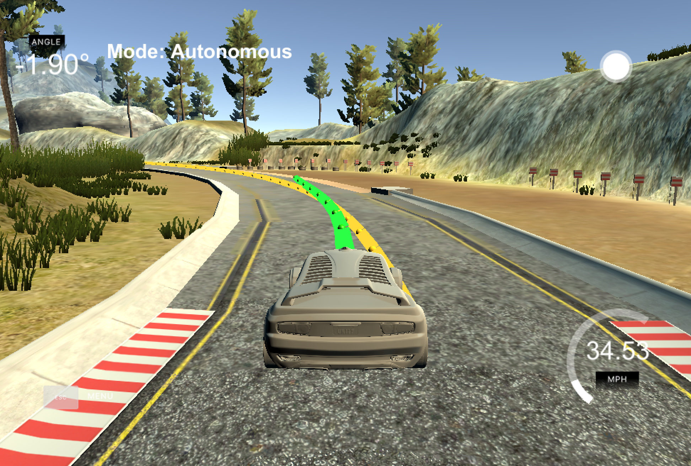
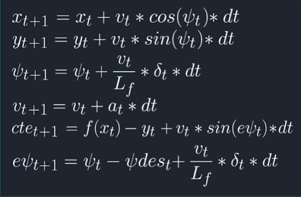
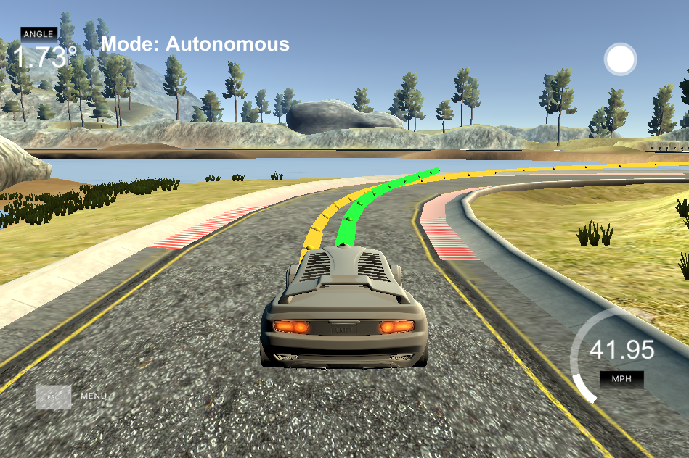

# CarND-Controls-MPC
Self-Driving Car Engineer Nanodegree Program

---

# Discussion



## State, Actuators, & Update Equations

### State: Future and Present

We can predict the state of the car this instant with great accuracy. The
waypoints we see in yellow and the state we predict should be as close as
possible. The present state does not reach the actuators in time, however.

To do this, my reviewers showed me how to implement the 100 ms delay in
prediction:

        const double latency = 0.1;
        const double Lf = 2.67;
        psi = delta;
        px = v*cos(psi)*latency;
        py = v*sin(psi)*latency;
        psi = v*delta*latency/Lf;

        v = v + a*latency;
        cte = cte + v*sin(epsi)*latency;
        epsi = epsi + v*delta/Lf*latency;

The future state of the actuators will have a more correct data to output
at that future time.

### Update Equations

These control the motion of the car in th efuture. The dt is 100 ms (.1)
and Lf was defined in the lessons as 2.67.



## Waypoints

In our model, waypoints are represented by `ptsx` and `ptsy` in `main.cpp`. They're translated into relative points from
the car's position via simple geometry, including a difference in measurement as seen in `x` and `y`.

We calculate the total CTE from this very difference with `polyfit` and `polyeval`. From this new state we can finally call `MPC.solve`.

## MPC.Solve

The first stages of `Solve` are to set up variable initialization and upperbounds. The real magic happens in `FG_eval`. The Iopt library is meant for finding optimization solutions and it's here where `FG_Eval` gets called by `CppAD::ipopt::solve`.

## FG_Eval

This MPC implementation does not include 100ms delay but instead use various penalizations for the cost function. An explicit attempt at latency is seen in the `latency_fixup` of this branch.

A real breakthrough in performance was found when turning linear equations inside of `FG_Eval` into 3rd order equations.

      AD<double> f0 = coeffs[0] + coeffs[1] * x0 + coeffs[2] *
        CppAD::pow(x0, 2) + coeffs[3] * CppAD::pow(x0, 3);

      AD<double> psides0 = CppAD::atan(coeffs[1] + coeffs[2] *
        x0 + coeffs[3] * CppAD::pow(x0, 2));

Perviously the car had problems with driving through the more complex and tight curves but could more easily handle the windy curve as seen below.



## Data Packing

As noted in the lectures, all of different states for things like delta, v, x, y, and start are in one long array. Their mappings into the data can be seen like so

    size_t x_start = 0;
    size_t y_start = x_start + N;
    size_t psi_start = y_start + N;
    size_t v_start = psi_start + N;
    size_t cte_start = v_start + N;
    size_t epsi_start = cte_start + N;
    size_t delta_start = epsi_start + N;
    size_t a_start = delta_start + N - 1;

## Parameters

### Timesteps (N) and dt

Timesteps (N) of less than 10 seemed to have a car that would careen of the road. Timesteps over 10 seem to give us cars that would want to drive in a straight line.

### Cost Penalizations

These values were binary searched for values in the thousands and incremented in lots of 1000.

## Some observations


# Dependencies & Building

* cmake >= 3.5
 * All OSes: [click here for installation instructions](https://cmake.org/install/)
* make >= 4.1(mac, linux), 3.81(Windows)
  * Linux: make is installed by default on most Linux distros
  * Mac: [install Xcode command line tools to get make](https://developer.apple.com/xcode/features/)
  * Windows: [Click here for installation instructions](http://gnuwin32.sourceforge.net/packages/make.htm)
* gcc/g++ >= 5.4
  * Linux: gcc / g++ is installed by default on most Linux distros
  * Mac: same deal as make - [install Xcode command line tools]((https://developer.apple.com/xcode/features/)
  * Windows: recommend using [MinGW](http://www.mingw.org/)
* [uWebSockets](https://github.com/uWebSockets/uWebSockets)
  * Run either `install-mac.sh` or `install-ubuntu.sh`.
  * If you install from source, checkout to commit `e94b6e1`, i.e.
    ```
    git clone https://github.com/uWebSockets/uWebSockets
    cd uWebSockets
    git checkout e94b6e1
    ```
    Some function signatures have changed in v0.14.x. See [this PR](https://github.com/udacity/CarND-MPC-Project/pull/3) for more details.

* **Ipopt and CppAD:** Please refer to [this document](https://github.com/udacity/CarND-MPC-Project/blob/master/install_Ipopt_CppAD.md) for installation instructions.
* [Eigen](http://eigen.tuxfamily.org/index.php?title=Main_Page). This is already part of the repo so you shouldn't have to worry about it.
* Simulator. You can download these from the [releases tab](https://github.com/udacity/self-driving-car-sim/releases).
* Not a dependency but read the [DATA.md](./DATA.md) for a description of the data sent back from the simulator.


## Basic Build Instructions

1. Clone this repo.
2. Make a build directory: `mkdir build && cd build`
3. Compile: `cmake .. && make`
4. Run it: `./mpc`.
